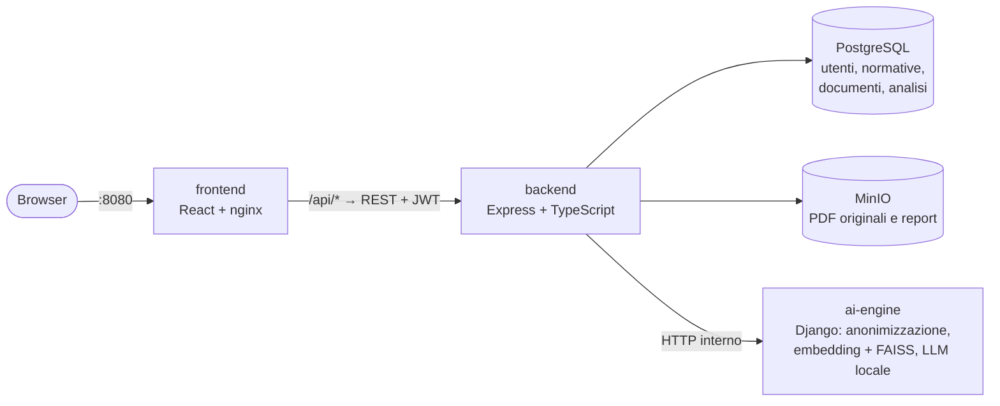

# ESG Insight

Piattaforma web per verificare la conformità di documenti aziendali in PDF rispetto alle principali normative e standard ESG (CSRD, EU Taxonomy, GRI, ISO 14001/45001/27001, DNF, ESRS E1, ...).

Il repository unisce in un unico progetto:

- **[Hack_AI_Thon](https://github.com/Bargi20/Hack_AI_Thon)** — interfaccia React e motore di analisi AI in Django (anonimizzazione, recupero semantico, LLM locale);
- **[Programmazione_Avanzata](https://github.com/zDarius21/Programmazione_Avanzata)** — backend Express/TypeScript con autenticazione JWT, gestione utenti e token, normative, documenti su MinIO e report.


## Indice

| Sezione | Contenuto |
|---------|-----------|
| [Architettura](#architettura) | Componenti e comunicazione tra i servizi |
| [Flusso di un'analisi](#flusso-di-unanalisi) | Cosa succede dal caricamento del PDF al report |
| [Avvio rapido con Docker](#avvio-rapido-con-docker) | Esecuzione dell'intera piattaforma |
| [Motore AI e modelli](#motore-ai-e-modelli) | Download dei modelli, LLM e requisiti di memoria |
| [Sviluppo locale](#sviluppo-locale) | Esecuzione dei singoli componenti senza Docker |
| [Test](#test) | Test automatici di backend e frontend |
| [Cosa cambia rispetto ai progetti originali](#cosa-cambia-rispetto-ai-progetti-originali) | Modifiche introdotte con l'integrazione |
| [Autori](#autori) | Team |

## Architettura



Il browser comunica solo con il backend: nginx serve l'interfaccia e inoltra le chiamate `/api/...` al backend Express, che autentica le richieste, applica le regole di business (ruoli, token, ownership dei documenti) e interroga il motore AI. Il motore AI non è esposto all'esterno e riceve solo richieste già autenticate.

| Cartella | Componente | Tecnologie | Porta |
|----------|------------|------------|-------|
| [frontend/](frontend/) | Interfaccia web | React 19, nginx | 8080 |
| [backend/](backend/) | API REST: autenticazione, utenti, token, normative, documenti, analisi, report | Node.js, Express, TypeScript, Sequelize, JWT RS256 | 3000 |
| [ai-engine/](ai-engine/) | Estrazione testo, anonimizzazione e analisi di conformità | Django, PyMuPDF, sentence-transformers, FAISS, transformers | interna (8000) |
| — | Database | PostgreSQL 16 | 5432 |
| — | Object storage | MinIO | 9000, 9001 (console) |

La documentazione completa delle API (rotte, errori, diagrammi di sequenza, design pattern) è nel [README del backend](backend/README.md).

## Flusso di un'analisi

1. L'utente si registra o accede e riceve un JWT firmato in RS256; ogni account parte con 100 token.
2. Trascina uno o più PDF nella pagina **Nuova analisi**: per ciascun file l'interfaccia mostra l'anteprima dell'anonimizzazione (dati mascherati per categoria ed estratto del testo), calcolata dal motore AI senza salvare nulla.
3. Avviando l'analisi, ogni PDF diventa un documento del backend (file salvato su MinIO) e viene inviato al motore AI, che estrae il testo, lo anonimizza e valuta le normative pertinenti; il backend addebita **10 token** per documento.
4. Il risultato viene salvato sul documento e il backend genera il report PDF (score, norme conformi e non conformi, azioni correttive), archiviandolo su MinIO.
5. L'utente consulta la dashboard e scarica il report; nella sezione **Documenti** ritrova lo storico, i PDF originali e i report. Gli amministratori gestiscono anche **Normative** e **Utenti** (ruoli e ricarica token).

## Avvio rapido con Docker

Requisiti: [Docker Desktop](https://www.docker.com/products/docker-desktop/) con almeno 8 GB di RAM assegnati se si usa l'LLM locale (vedi sotto).

```bash
cp .env.example .env        # su Windows (PowerShell): Copy-Item .env.example .env
docker compose up --build
```

| Servizio | Indirizzo |
|----------|-----------|
| Interfaccia web | http://localhost:8080 |
| API REST (cURL / Postman) | http://localhost:3000 |
| Console MinIO | http://localhost:9001 |

Al primo avvio vengono generate automaticamente le chiavi RSA per i JWT (`backend/keys/`) e il database viene popolato con le normative e alcuni account di prova:

| Email | Password | Ruolo |
|-------|----------|-------|
| admin@example.com | Admin+123 | admin |
| dario@example.com | Dario+123 | user |
| andrea@example.com | Andrea+123 | user |

Per arrestare i servizi: `docker compose down` (aggiungendo `-v` si cancellano anche database, file caricati e modelli scaricati).

> Se è ancora presente lo stack del vecchio progetto Programmazione_Avanzata, va fermato prima dell'avvio perché usa le stesse porte (3000, 5432, 9000).

## Motore AI e modelli

Il motore AI usa un modello di embedding multilingue per individuare le normative pertinenti e un LLM locale per valutarne la conformità, con fallback automatico a regole deterministiche.

- **Primo avvio**: i modelli vengono scaricati da Hugging Face nel volume `ai_models` (modello di embedding ~0,5 GB; con LLM attivo anche TinyLlama ~2,2 GB) e caricati in background. Fino al termine le analisi restano in attesa; se l'attesa supera `AI_ENGINE_TIMEOUT_MS` (5 minuti) l'interfaccia mostra «motore AI non raggiungibile» ed è sufficiente riprovare. Gli avvii successivi riusano la cache.
- **`MAX_SEMANTIC_EVALUATIONS`** (nel `.env`): numero di normative valutate dall'LLM per ogni analisi (predefinito `2`, come nel progetto originale). Con `0` l'LLM non viene caricato e l'analisi usa solo embedding e regole: è molto più veloce e richiede circa 1 GB di RAM.
- **Modello LLM**: il principale (`meta-llama/Llama-3.2-3B-Instruct`) è ad accesso riservato e richiede un `HF_TOKEN` con accesso approvato; senza token viene usato il fallback `TinyLlama-1.1B-Chat`. Su CPU i modelli girano in precisione float32: TinyLlama occupa circa 4,5 GB di RAM, Llama 3.2 3B circa 13 GB.
- **Tempi indicativi** (CPU, documento di esempio `ai-engine/sample_input_esg.pdf`): meno di 1 secondo con `MAX_SEMANTIC_EVALUATIONS=0`, circa 45 secondi con TinyLlama. Nei test con TinyLlama le risposte del modello sono state scartate dai controlli di validità del motore e la valutazione è ricaduta sulle regole deterministiche: per una valutazione semantica effettiva conviene Llama 3.2 su una macchina con RAM sufficiente.

Per la conformità, il motore AI usa la propria base di conoscenza normativa interna (`ai-engine/chatbot/views.py`), allineata alle normative presenti nel catalogo del backend.

## Sviluppo locale

Per lavorare sul codice con il ricaricamento automatico si possono avviare in Docker solo database e storage, ed eseguire gli altri componenti in locale. Tutti leggono il `.env` nella root.

```bash
cp .env.example .env
docker compose up -d db minio
```

**Backend** (Node.js 20+) — http://localhost:3000

```bash
cd backend
npm install
npm run keys      # genera backend/keys/private.pem e public.pem
npm run dev
```

**Motore AI** (Python 3.10/3.11) — http://localhost:8000

```bash
cd ai-engine
python -m venv .venv
.venv\Scripts\activate          # Linux/macOS: source .venv/bin/activate
pip install -r requirements.txt
python manage.py runserver
```

**Frontend** — http://localhost:3001 (le chiamate `/api` vengono inoltrate al backend su `localhost:3000` da `src/setupProxy.js`)

```bash
cd frontend
npm install
npm start
```

## Test

```bash
cd backend && npm test        # Jest: middleware, client del motore AI, generazione del report
cd frontend && npm test       # React Testing Library
```

Con la piattaforma avviata in Docker i test del backend si eseguono anche con `docker compose exec backend npm test`. La collection Postman del backend si trova in [backend/postman/](backend/postman/).

## Cosa cambia rispetto ai progetti originali

**Backend**
- L'analisi (`POST /documents/:id/analyze`) non restituisce più risultati fissi: il PDF viene analizzato dal motore AI e il risultato è salvato sul documento (colonna `analysisResult`) e usato per il report.
- Nuove rotte `POST /documents/anonymize-preview` e `GET /documents/:id/report`, nuovi errori (`ERR_AI_ENGINE_UNAVAILABLE`, `ERR_AI_ENGINE_ERROR`, `ERR_DOCUMENT_NOT_READABLE`, `ERR_ANALYSIS_IN_PROGRESS`).
- Le variabili d'ambiente vengono caricate prima degli altri moduli, così `npm run dev` funziona anche fuori da Docker; nuovo script `npm run keys` e nuovi test Jest.

**Frontend**
- Accesso e registrazione, saldo token, analisi tramite il backend con anteprima di anonimizzazione, storico **Documenti**, catalogo **Normative** (gestione per gli admin), gestione **Utenti** per gli admin e pagina **Profilo**.
- In Docker viene servito da nginx, che fa da reverse proxy verso il backend.

**Motore AI**
- Configurazione da variabili d'ambiente (`DJANGO_SECRET_KEY`, `DJANGO_DEBUG`, `DJANGO_ALLOWED_HOSTS`, `MAX_SEMANTIC_EVALUATIONS`), endpoint `GET /api/health/`, caricamento dei modelli thread-safe con preload all'avvio sotto gunicorn, Dockerfile con PyTorch solo CPU.
- Rimosse dalle dipendenze le librerie non utilizzate dal codice (`chromadb`, `google-genai`, `onnxruntime`).

## Autori

- Dario Tommasi ([GitHub](https://github.com/zDarius21))
- Andrea Bargilli ([GitHub](https://github.com/Bargi20))
